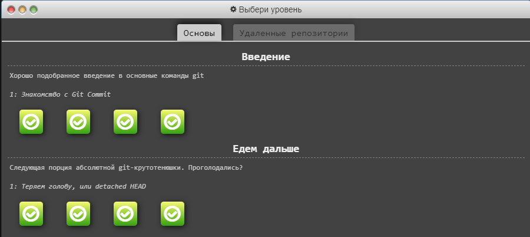
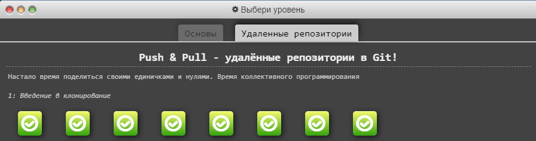
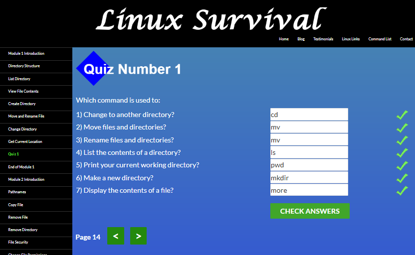
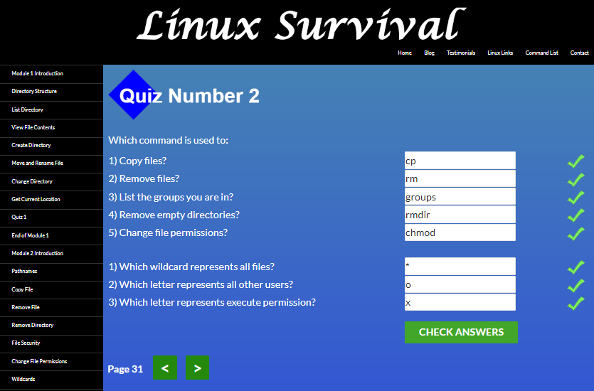
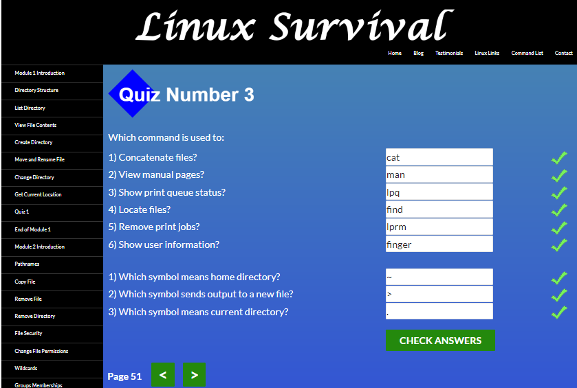
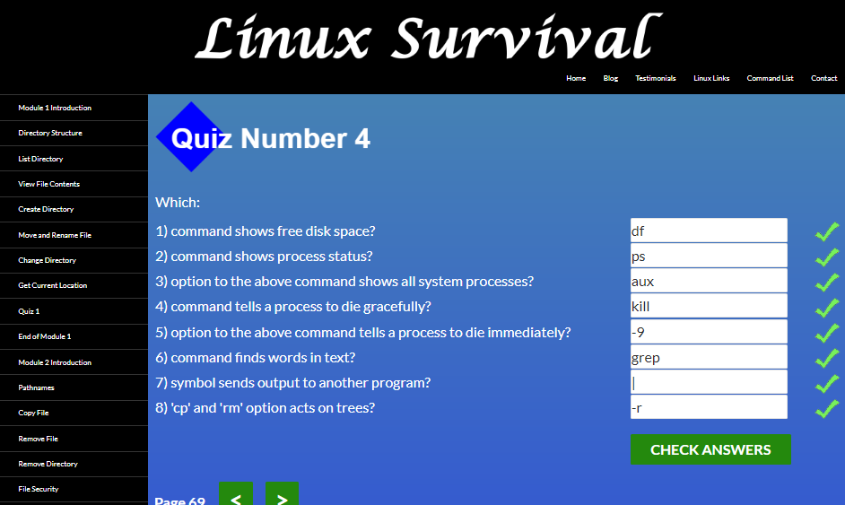

## Git та GitHub

After completing first 2 weeks of the course **Introduction to Git and GitHub**, `I've wrapped my head around all these new concepts`.

Learning at **LearnGitBranching** was like playing a game where you have to pass levels. I liked the visualization of what happens behind the scenes of the command line.
I am going to apply the acquired skills to store my code's history in Git and collaborate with others in GitHub.

## Linux CLI, and HTTP
Linux Survival course provides all the fundamentals of Linux. I am familiar with basic Linux commands. 
New ones were: `man`, `ps` (with its option `aux`), `grep` and `|` symbol, which sends output to another program.
`kill` command, which tells a process to die gracefully, and its option `-9`, which tells a process to die immediately, suprised me.
The course helped me to understand important aspects of working with Linux, which I will use in the future.

**HTTP articles** [(1)](https://code.tutsplus.com/tutorials/http-the-protocol-every-web-developer-must-know-part-1--net-31177?ec_unit=translation-info-language "HTTP: The Protocol Every Web Developer Must Know  - Part 1") and [(2)](https://code.tutsplus.com/tutorials/http-the-protocol-every-web-developer-must-know-part-2--net-31155?ec_unit=translation-info-language "HTTP: The Protocol Every Web Developer Must Know - Part 2") expanded my knowledge of the HTTP protocol.
 

## Git Collaboration
  * 3 and 4 modules of **Introduction to Git and GitHub** explain me how to work with remotes, tackle conflicts by utilizing the pull-merge-push workflow. Also, how the typical workflow of a pull request looks like on GitHub and what the code review workflow looks like. All this collaboration tools will definitely help improve the quality of my code and keep my code better trackable in the future.

[week 3](2.task_git_collaboration/git_colllab(3).png)

[week 4](2.task_git_collaboration/git_colllab(4).png)

  * **main** and **remote** levels at **LearnGitBranching** help me to be more comfortable with fetching and merging, pulling and pushing. I've learned all about git fetch, pull and push arguments and colon refspecs `(<source>:<destination>)`.

[main](2.task_git_collaboration/2022-08-16_10-59-06.png)
 
[remote](2.task_git_collaboration/2022-08-16_10-53-45.png)
